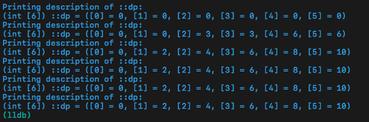

<p align="center">
  <a href="http://shallweitalk.com">
    
  </a>
  <h3 align="center">Stone</h3>
  <p align="center">
    <a href="http://shallweitalk.com">
      
    </a>
  </p>
</p>
<br>


## 什么是"0-1背包"和"完全背包"

### 0-1背包问题
有 n 个重量和价值分别为 wi vi 的物品，从这些物品中挑出总重量不超过 W 的物品，每个物品只能选`一次`，求所有挑选方案中价值总和最大值。
### 完全背包问题
这个和上面那个问题差不多，但这次每件物品可以选`多次`。

>其中背包就是一个容器，可以是一个背包，一个队列，也可以是一个具体的数字，也可以是一个别的什么东西，总之就是一个范围约束。
而物品可以是一组东西，一组数字，或是别的。只要是类似于这种用小东西填满一个大区间的问题，都有可能是背包问题。
背包问题种类多变，有的背包问题不是很明显，例如[简单的数的划分](http://cxsjsxmooc.openjudge.cn/2017t2summerw3/2/)，
对于这种不能一眼看出来的问题，只有通过多做题才能水到渠成了。

## 经典题目

#### 0-1背包
- [正整数分组](https://www.51nod.com/onlineJudge/questionCode.html#!problemId=1007)

#### 完全背包
- ~~[将一个数划分成不同的数，问有几种划分的方法](http://cxsjsxmooc.openjudge.cn/2017t2summerw3/2/)（这个页面已经找不着了）~~

## DP数组意义

```cpp
int dp[N][N]; // 在前i个物品中选择总重量不超过j的物品时的-->`什么属性`

int dp[N]; // 这里一维的是用覆盖的方式把第一维给省去了
```

`什么属性`是根据题目中要求的东西决定的，有可能是最大值，最多的种类数， 最小值之类的东西。

## 思路

#### 0-1背包
和所有的DP问题一样，我们的重点是要找出子问题，然后推出状态转移方程。假设现在的问题是最基本的：

`将5件价值分别是value[i], 占据空间大小分别是fee[i], 求当前背包所能装下的最大价值`。

那么它的状态转移方程就是：`dp[i][j] = max(dp[i-1][j], dp[i-1][j-fee[i]] + value[i])`

>翻译过来就是：只放`前i个物品刚好装满j容量`这个`状态` **来自** 只放`前i - 1个物品到j容量`这个`状态`或者只放`前i - 1个物品到j减第i个物品的体积容量`这个`状态`

比如，我们要放第5个物品，他是个苹果，它值5块钱，但是占据了书包4（管他什么单位呢）的空间。但是书
包这时候已经装过了4件物品。那么当我们想要产生`把用过苹果后最大值`的背包状态时
（管他苹果到底有没有装进去呢，反正我是用过了。）就有了下面这个转移方程

```cpp
dp[5][j] = max(dp[4][j], dp[4][j-4] + 5);
                  不放         放
```
这里的j就是从小到大遍历一遍背包的容积，因为必须先把子状态找出来，才能推出下一个子状态。

## coding

#### 0-1背包基本款

```cpp
const int N = 6;
int dp[N][N]; // 用前i个物品装的最大的种类数。
int fee[5] = { 0, 2, 1, 3, 2 };
int value[5] = { 0, 3, 2, 4, 2 };
int n = 4;
int m = 5;

void solve()
{
    for (int i = 1; i <= n; i++){ // 物品循环
        for (int j=1; j <= m; j++){ // 容量循环
            if (j < fee[i]) {
                dp[i][j] = dp[i - 1][j]; // 装不下
            } else {
                dp[i][j] = max(dp[i - 1][j], dp[i - 1][j - fee[i]] + value[i]); // 装或不装
            }
        }
    }
    printf("%d\n", dp[n][m]);
}

int main(void)
{
    solve();
    return 0;
}
```
#### 0-1背包一维

```cpp
void solve()
{
    for (int i = 1; i <= n; i++){ // 物品循环
        for (int j = m; j >= fee[i]; j--){ // 容量循环（从后向前）
            dp[j] = max(dp[j], dp[j - fee[i]] + value[i]);
        }
    }
    printf("%d\n", dp[m]);
}
```
下面是每次循环中的dp数组变动情况。


#### 完全背包基本款

```cpp
const int N = 6;
int dp[N - 1][N]; // 装满i容量的最大价值
int fee[5] = { 0, 2, 1, 3, 2 };
int value[5] = { 0, 3, 2, 4, 2 };
int n = 4;
int m = 5;

void solve()
{
    for (int i = 1;i <= n; i++){ // 物品循环
        for (int j = 1; j <= m; j++){ // 容量循环
            if (j < fee[i]) {
                dp[i][j] = dp[i - 1][j];
            } else {
                dp[i][j] = max(dp[i - 1][j], dp[i][j - fee[i]] + value[i]);
                //                           这里！
            }
        }
    }
    printf("%d\n", dp[n][m]);
}

int main(void)
{
    solve();
    return 0;
}
```
下面是每次循环中的dp数组最终情况。


#### 完全背包一维

```cpp
void solve()
{
    for (int i = 1; i <= n; i++){ // 物品循环
        for (int j = fee[i]; j <= m; j++){ // 容量循环
            dp[j] = max(dp[j], dp[j - fee[i]] + value[i]);
        }
    }
    printf("%d\n", dp[m]);
}
```
下面是每次循环中的dp数组变动情况。



## 总结

    wait...... 

## 参考
[背包九讲](http://love-oriented.com/pack/)