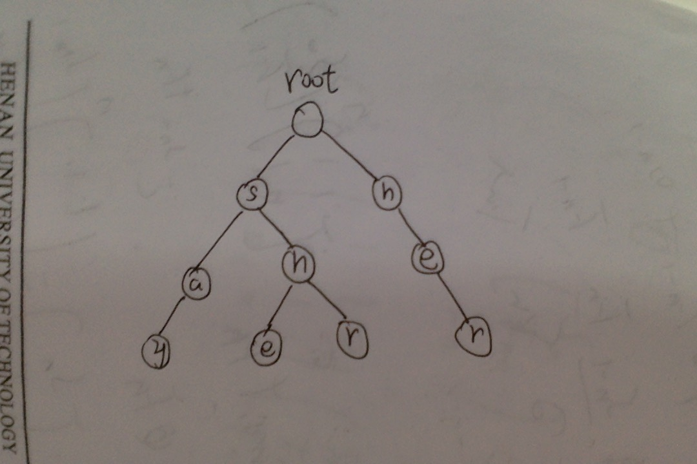
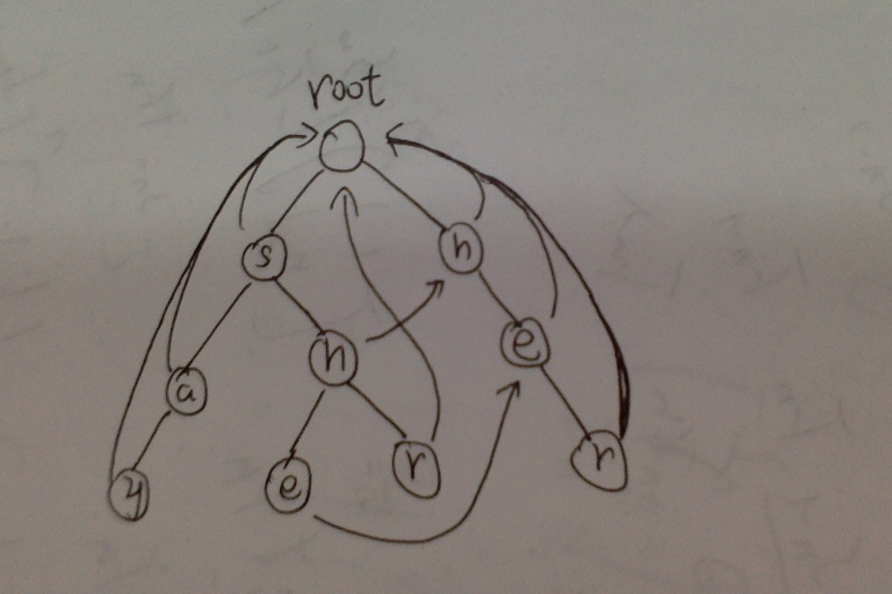

  
  <h3 align="center">Stone</h3>

  

    
  

 

## AC自动机的用处

在常数时间内，解决`串1`和`一堆串2`的匹配问题。是KMP的升级版

## 字典树--AC自动机的基础

其实呢，这个树没有听起来那么玄乎，是一个很简单的树形结构。只不过是把相同的前缀合并了起来而已。
    
    假如我们用she, he, say, shr, her建一棵字典树,他会长成下面这个样子👇🏻

    可见she, shr的前缀'sh'合并起来了,she, shr, say的前缀's'也合并了。这就是字典树，建这么一棵树是很容易的。

## AC自动机

AC自动机用的也是字典树，在建树的时候，树形是完全一样的，就是会对这棵树做一些特殊的加工。为了完成算法的目的。
要对字典树进行标记和加工。fail指向的是字符发生不匹配时应该返回的位置。见下图

    然后经过代码实现上述过程就可以了，不难理解。

## 总结

AC自动机难的地方就在于它的查询函数，对与每一道题，你的查询函数，基本上都要做出不同的修改，这么一改
就容易出问题，而且中间的跳转还是比较复杂的稍微调不好就会通过不了。改的时候请细心仔细，慢功出细活。

## 参考

- [字典树概念](http://songlee24.github.io/2015/05/09/prefix-tree/)
- [字典树模版题](http://acm.hdu.edu.cn/showproblem.php?pid=1251)
- [字典树模版题代码实现](http://blog.csdn.net/cambridgeacm/article/details/7752247)
- [AC自动机理解](http://blog.csdn.net/niushuai666/article/details/7002823)
- [AC自动机模版题](http://acm.hdu.edu.cn/showproblem.php?pid=2222)
- [AC自动机模版题代码实现](http://blog.csdn.net/hnust_xiehonghao/article/details/9130539)